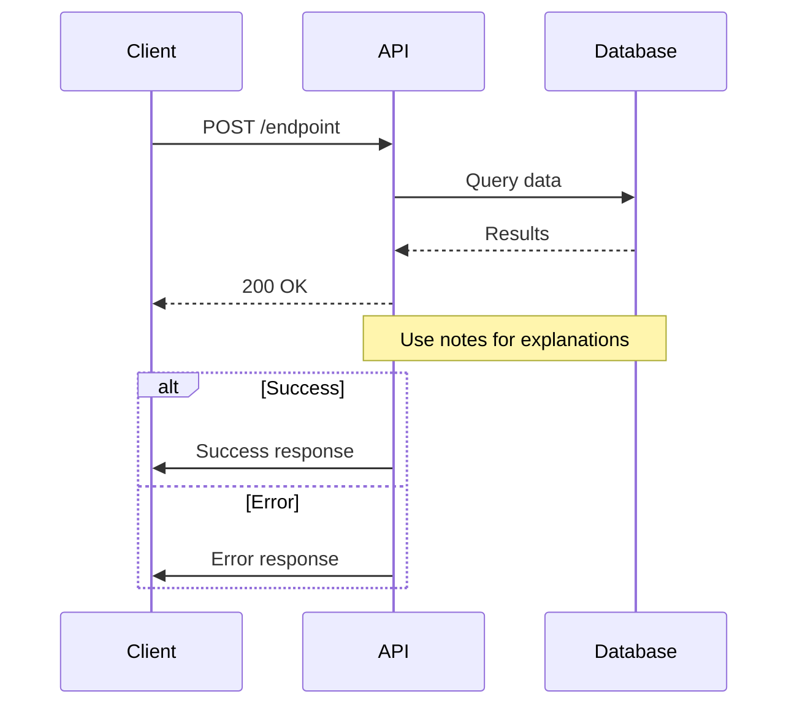
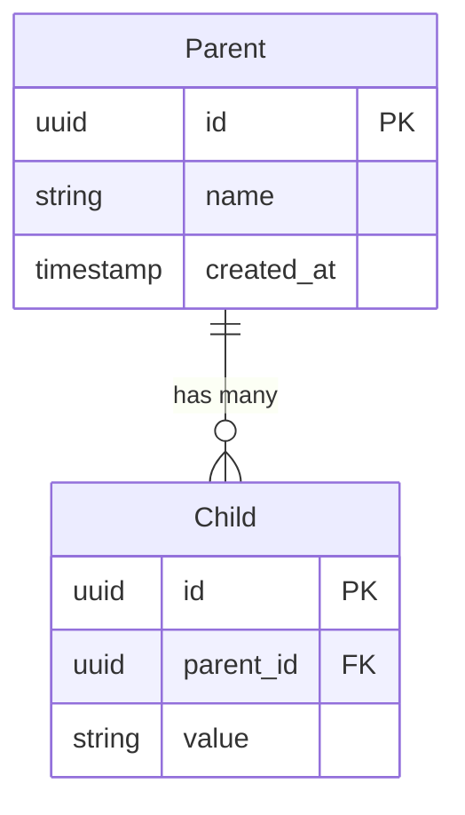
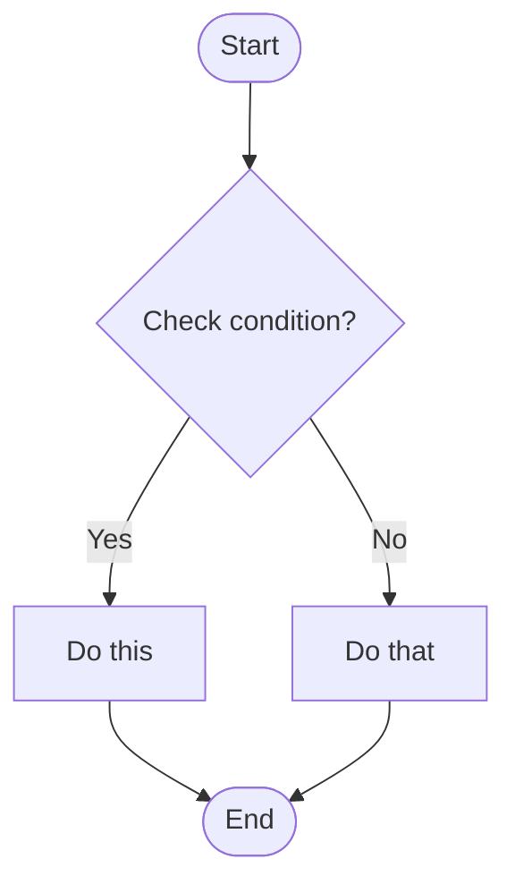
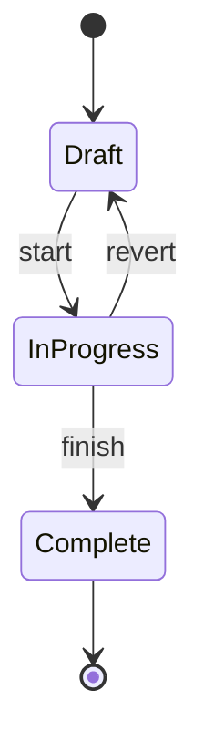
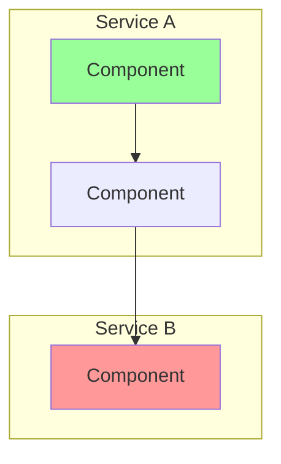
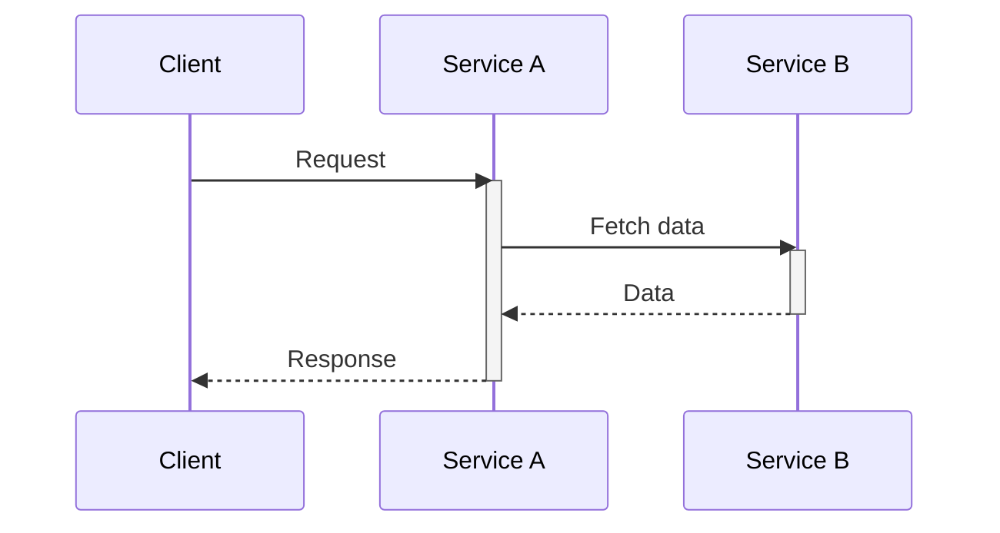
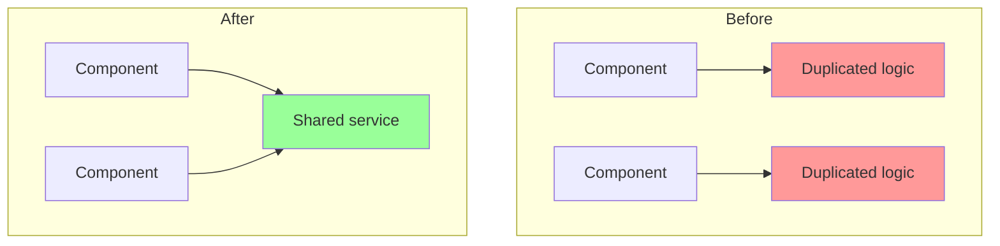
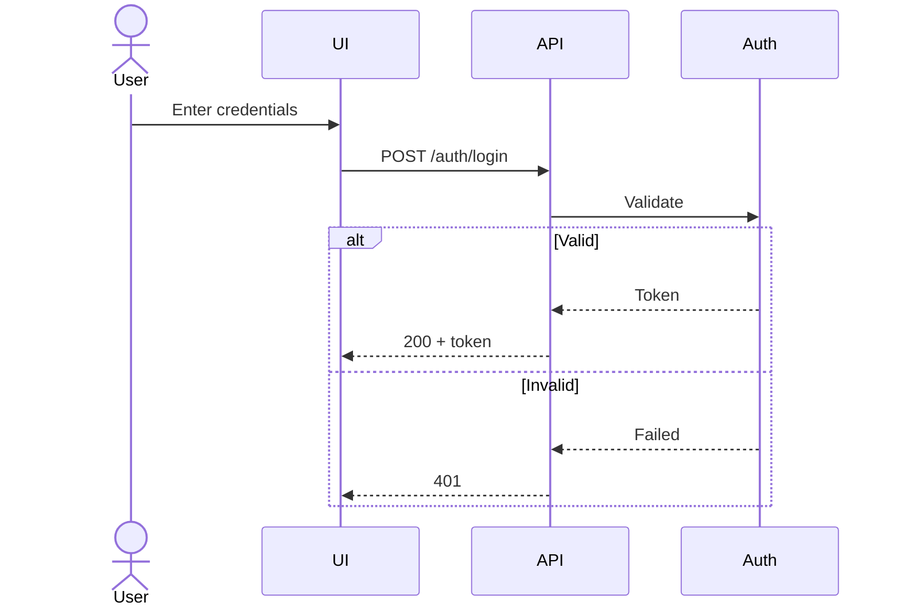

# Purpose

Create structured work packets (features, bugs, chores) in Work KBs. Generates complete packet directories with README.md, STATUS.md, ARCHITECTURE_DIAGRAMS.md, and folders for prompts and completions.

**Philosophy:** Start with diagrams, then write code. If you can't diagram it cleanly, the design probably isn't clear yet.

## Instructions

### 1. Gather Information

Parse provided arguments. For missing information, use AskUserQuestion:

**If type is missing:**
```
What type of packet?
- "feature" - New functionality
- "bug" - Fix something broken
- "chore" - Maintenance/refactoring
```

**If name is missing:**
```
What's the name? (kebab-case, e.g., add-dark-mode)
```

**If target KB path is missing:**
```
Where should the packet be created? (path to Work KB)
```

**Always ask:**
```
Brief description of this work?
```

**Optional:**
```
Code repository path? (where changes will be made)
```

### 2. Create Packet via CLI

```bash
bun ${CLAUDE_PLUGIN_ROOT}/cli/bin/core packet create "{type}" "{name}" --target "{target-kb-path}" --description "{description}" --code-repo "{code-repo}" --project-dir "${CLAUDE_PROJECT_DIR}"
```

### 3. Handle Response

**If `success: true`:**

```
Created {data.type} packet: {data.name}

Location: {data.path}

Files:
- README.md (mission document)
- STATUS.md (progress tracking)
- ARCHITECTURE_DIAGRAMS.md (design visualization)
- prompts/ (implementation steps)
- completions/ (reports)

Next: Create architecture diagrams to clarify the design
```

**If `success: false`:**

Based on `reason`:
- "already exists": "Packet '{name}' already exists. Use a different name or switch to it."
- "not a valid Work KB": "Path is not a Work KB. Work KBs need a features/ directory."
- "Invalid packet type": "Type must be feature, bug, or chore."
- Otherwise: Report the error

### 4. Offer to Continue with Diagrams

After successful creation, ask:

```
Would you like to create architecture diagrams now?

Recommended workflow:
1. Sequence diagram - Map API/component interactions
2. ERD - Database schema changes (if applicable)
3. Flowchart - Complex decision logic (if applicable)
4. Define success criteria
5. Break down into implementation prompts

This helps catch design issues before writing code.
```

If yes, help them flesh out ARCHITECTURE_DIAGRAMS.md using the patterns in the Mermaid Quick Reference below.

## Example

User: `/create-packet feature add-auth /path/to/work-kb`

1. Ask: "Brief description?"
2. User: "Add user authentication with JWT"
3. Ask: "Code repository path? (optional)"
4. User: "/path/to/app"
5. Run CLI: `bun ${CLAUDE_PLUGIN_ROOT}/cli/bin/core packet create "feature" "add-auth" --target "/path/to/work-kb" --description "Add user authentication with JWT" --code-repo "/path/to/app" --project-dir "${CLAUDE_PROJECT_DIR}"`
6. Response: `{"success": true, "data": {"type": "feature", "name": "add-auth", "path": "...", "files": [...]}}`
7. Report creation and offer to continue with diagrams
8. If yes, help create sequence diagram for auth flow, etc.

---

## Mermaid Quick Reference

Use these patterns when helping create architecture diagrams.

### Sequence Diagrams - API/Component Interactions

**When to use:** Understanding how components interact, API flows, service calls



**Key syntax:**
- `->>` : Solid arrow (request)
- `-->>` : Dashed arrow (response)
- `participant X as Label` : Named participants
- `Note over A,B:` : Span note across participants
- `alt/else/end` : Conditional branches
- `activate/deactivate` : Show active processing

### Entity Relationship Diagrams - Database Schema

**When to use:** Planning database changes, understanding relationships



**Relationship symbols:**
- `||--||` : One-to-one
- `||--o{` : One-to-many
- `}o--o{` : Many-to-many
- `||--o|` : One-to-zero-or-one

### Flowcharts - Decision Logic & Processes

**When to use:** Business logic, validation flows, branching decisions



**Node shapes:**
- `[Text]` : Rectangle (process)
- `{Text}` : Diamond (decision)
- `([Text])` : Rounded (start/end)
- `[[Text]]` : Subroutine
- `[(Text)]` : Database

**Direction:**
- `flowchart TD` : Top-Down
- `flowchart LR` : Left-Right

### State Diagrams - Status/Lifecycle Flows

**When to use:** Object states, workflow status, valid transitions



### Graph Diagrams - Architecture & Dependencies

**When to use:** System architecture, component relationships, data flow



### Common Patterns

**Cross-Service API Call:**


**Before/After Architecture:**


**Authentication Flow:**


### Styling

**Colors:**
- `style NodeName fill:#9f9` : Green (success/correct)
- `style NodeName fill:#f99` : Red (error/wrong)
- `style NodeName fill:#ff9` : Yellow (warning)
- `style NodeName fill:#99f` : Blue (info)

**Line styles:**
- `-->` : Solid arrow
- `-.->` : Dashed arrow
- `==>` : Thick arrow
- `-->|label|` : Arrow with label

### Tips

1. **Keep it simple** - Don't diagram every detail. Focus on what clarifies the design.
2. **Test your diagrams** - Use https://mermaid.live for live preview
3. **Label everything** - Use `|label|` on arrows and notes for context
4. **If it's too complex, redesign** - Diagram complexity often reflects design complexity
